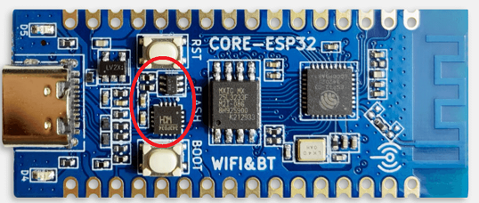
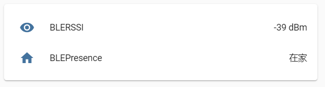

# HomeAssistant_BLETracker
基于HomeAssistant MQTT Discovery 的 蓝牙RSSI判定在家状态项目。判断是否在家状态后，通过HA自动化进行智能联动。  
__本项目目前为Demo版，暂无后续更新计划...__  
第一次在Github开源项目，有问题可以在Issues进行反馈，代码写的不好请轻喷...

## 开发基础
> ### 硬件配置
> * 合宙ESP32C3开发板经典版（非简约版，两个按键间有元器件） 
>   
> 简约版（无按键版也可通过Arduino IDE进行开发）  
> 参考B站专栏：[ESP32-C3，不用USB转串口芯片如何开发](https://www.bilibili.com/read/cv13107494)  
> ### 软件配置
> * MQTT服务器
> * HomeAssistant系统（已配置好MQTT）

## 开发环境
> * VScode+platformio  相关配置教程网上有很多
> * 开发板配置参考B站专栏：[使用PlatformIo 把玩 合宙ESP32-C2](https://www.bilibili.com/read/cv16215201)

## 文件配置
对以下两个`.h`文件进行相应修改
### `config.h`
> __以下表中内容请务必进行修改__ 
> 
> |  变量   | 备注  |
> |  :-:  | :-  |
> | `ssid`  | 连接WIFI的SSID |
> | `password`  | 连接WIFI的SSID的密码 |
> | `mqttServer`  |  MQTT服务器IP地址|
> | `mqttPort`  | MQTT服务器端口号 |
> | `mqttUser`  | MQTT服务器用户名 |
> | `mqttPassword`  | MQTT服务器用户密码 |

> * `client_id`、`blepresence_UID`、`blerssi_UID`可以根据个人需要进行修改
> 
> * `Presence_Config`、`RSSI_Config`、`Availability_topic`、`Presence_State`、`RSSI_State`和MQTT Discovery相关，如若修改请确定已认真阅读HomeAssistant MQTT Discovery官方文档[HomeAssistant MQTT Discovery官方文档](https://www.home-assistant.io/docs/mqtt/discovery/)

### `BLETracker.h`
> |  变量   | 备注  |
> |  :-:  | :-  |
> | `BLE_OffLine_N`  |  连续`BLE_OffLine_N`次扫描，没有扫描到蓝牙设备，确认其为离线状态|
> | `BLE_Buff`  | 每次扫描蓝牙设备，缓冲区大小，大于最多扫描到蓝牙设备数量 |
> | `scanTime`  | 执行一次扫描的时间 |   

> __以下内容请务必进行修改__ 
> * `BLE_User BLE_Users`中的`蓝牙MAC地址`设置为需要检测设备的MAC地址（打开设备的蓝牙广播）   
> * `设备在线时RSSI下限`描述为当扫描到的蓝牙RSSI（信号强度）大于这个数值，才判定为在家状态，否则为离家状态。合理的设置参数可以满足用于检测位于哪个房间。

## 实现效果
> * 追踪的蓝牙设备为小米手环7（通常为穿戴设备），在APP中打开蓝牙广播功能。
> * 将软件程烧录到ESP32C3中
> 测试结果如下  
>  
